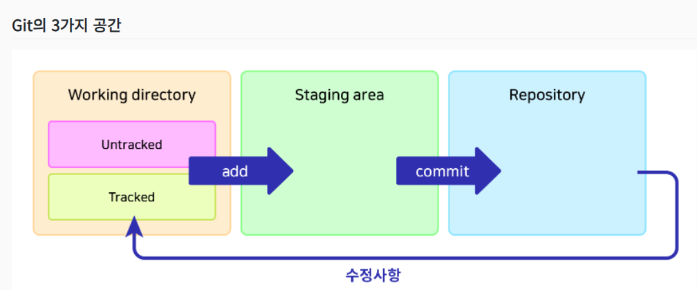

# 제대로 파는 Git & GitHub - by 얄코

#### 해당 강의의 개념 메모는 블로그에 올릴예정이므로, 본 글에는 Commit 컨벤션 및 Git 명령어를 정리해 볼 생각이다.


<br>


### 강의링크

- [강의 바로가기](https://www.inflearn.com/course/%EC%A0%9C%EB%8C%80%EB%A1%9C-%ED%8C%8C%EB%8A%94-%EA%B9%83)


<br>


## 커밋 메시지 컨벤션
```
type : subject

body (optional)
...
...
...

footer (optional)
```
- **Type**
  - feat: 새로운 기능 추가
  - fix: 버그 수정
  - docs:	문서 수정
  - style:	공백, 세미콜론 등 스타일 수정
  - refactor:	코드 리팩토링
  - perf:	성능 개선
  - test:	테스트 추가
  - chore:	빌드 과정 또는 보조 기능(문서 생성기능 등) 수정
- **Subject** : 커밋의 작업 내용 간략히 설명
  -  최대 50글자가 넘지 않도록 하고 마침표 생략
  -  영문으로 표기하는 경우 동사(원형)를 가장 앞에 두고 첫 글자는 대문자로 표기
- **Body** : 길게 설명할 필요가 있을 시 작성
  - 어떻게 했는지가 아니라, 무엇을 했는지 또는 왜 했는지를 작성
  - 한줄당 72자 내로 작성
- **Footer**
  -  Breaking Point가 있을 때
  -  특정 이슈에 대한 해결 작업일 때

#### 커밋 컨벤션 예시 (with [gitmoji](https://gitmoji.dev/))
```
✨ 추가 로그인 API (#1)

로그인 API 개발

Ref: #777
```

## 강의에서 메모한 Git 명령어들 모음

<details>
<summary>Git Config</summary>
<div markdown="1">       

  - 현재 모든 설정값 보기
      - ```git config (global) —list```
      - j : ↓  ,  k : ↑
  - 전역 이름 설정
      - ```git config --global user.name "이름"```
  - 전역 이름 확인
      - ```git config --global user.name```
  - 전역 이메일 설정
      - ```git config --global user.email "이메일"```
  - 전역 이메일 확인
      - ```git config --global user.email```

> #### ⭐ 전역 설정이 아닌 해당 워크스페이스 설정일 시 --global 을 제외하면 됨 ⭐


  - 기본 브랜치명 변경
      - ```git config --global init.defaultBranch main```

  - 줄바꿈 호환 문제 해결 (윈도우: true / 맥: input)
      - ```git config --global core.autocrlf true```
  
  - pull 기본 전략 선택 (merge or rebase)
      - ```git config pull.rebase false``` → merge 방식
      - ```git config pull.rebase true``` → rebase 방식

  - Git 단축키 설정
      - ```git config --global alias.(지정할 단축키) “명령어”```
      - ex) git config --global alias.cam “commit -am”
  
  - push 시 로컬과 동일한 브랜치명 설정
    - ```git config --global push.default current```

</div>
</details>


<details>
<summary>Local</summary>
<div markdown="1">
  
- 워크스페이스에 git 세팅
    - ```git init```
- stage에 올리기
    - ```git add {파일명}```
- 모든 파일 stage에 올리기
    - ```git add .```
- commit
    - 일반 커밋
        - vi 모드 → 메시지 입력후 종료(:wq!) 시 커밋진행
        - [IntelliJ vi 모드 입력 닫기(esc) 안될 시 설정방법](https://sw-architect.tistory.com/20)
    - 커밋메시지 입력과 동시에 커밋
        - ```git commit -m {”커밋메시지”}```
    - add+commit (untracked 파일이 없을 시)
        - ```git commit -am {“메시지”}```
    - 커밋메시지 변경
      - ```git commit --amend -m 'Add members to Panthers and Pumas'```
- git 상태 확인
    - ```git status```
- git 상태 자세히 확인
    - ```git diff```
    - 터미널 창이 충분하지 않을 경우 읽기모드로 들어감
        
        
        | 작업 | Vi 명령어 | 상세 |
        | --- | --- | --- |
        | 위로 스크롤 | k | git log등에서 내역이 길 때 사용 |
        | 아래로 스크롤 | j | git log등에서 내역이 길 때 사용 |
        | 끄기 | :q | :가 입력되어 있으므로 q만 눌러도 됨|

</div>
</details>


<details>
<summary>Branch</summary>
<div markdown="1">       

 - 브랜치 생성
    - ```git branch {브랜치명}```
- 브랜치 목록 확인
    - ```git branch```
- 브랜치 이동
    - ```git switch {브랜치명}```
    - ```git checkout {브랜치명}```
        - git 2.23 버전부터 checkout이 분리됨
        1. switch
        2. restore
- 브랜치 생성과 동시에 이동
    - ```git switch -c {브랜치명}```
    - ```git checkout -b {브랜치명}```
- 브랜치 삭제
    - ```git branch -d {브랜치명}```
- 브랜치명 변경
    - ```git branch -m {기존 브랜치명} {새 브랜치명}```
- 브랜치 합치기
    - merge
        - ```git merge {합쳐질 브랜치명}```
    - merge 중단
        - ```git merge --abort```
    - rebase
        1. ```git switch {합쳐질 브랜치명}```
        2. ```git rebase {합칠 브랜치명}```
        3. ```git merge {합친 브랜치명}```
        합친 브랜치의 헤드를 merge를 통하여 가지 끝까지로 이동
    - rebase 중단
        - ```git rebase --abort```
    - 충돌 한건 수정 후 stage에 올리고 계속 진행
        - ```git rebase --continue ```
- 로컬에 동일한 이름의 브랜치를 생성, 연결하여 switch
    - ```git switch -t origin/{브랜치명}```
- 원격 브랜치 삭제
    - ```git push {원격이름} --delete {원격의 브랜치명}```
 
</div>
</details>


<details>
<summary>Git Repository</summary>
<div markdown="1">       

- git 원격 저장소 추가
    - ```git remote add origin {원격 저장소 주소}```
- 기본 브랜치명을 main으로 변경
    - ```git branch -M main```
- 원격에 push
    - ```git push -u origin main```
    - -u : 현재 브랜치와 명시된 원격 브랜치를 default로 연결
- 원격 저장소에 commit 내역 밀어올리기
    - ```git push```
- 원격의 commit 내역 당겨오기
    - ```git pull```
- push 할 시 pull 하는 두가지 방법
    - merge 방식
        - ```git pull --no-rebase```
    - rebase 방식
        - ```git pull --rebase```
    - pull이 완료된 후 push 진행
- 로컬의 commit 내역으로 강제 push
    - ```git push --force```
- 원격의 변경사항 업데이트
    - ```git fetch```

</div>
</details>


<details>
<summary>Stash</summary>
<div markdown="1">       

  - 변경사항 보관
    - ```git stash```
  - 변경사항 적용
    - pop : apply + drop
    - ```git stash pop```
  - 변경사항 일부 보관
    - ```git stash -p```
  - 메시지와 함께 보관
    - ```git stash -m '스태시 테스트'```
  - 스태시 목록 보기
    - ```git stash list```

</div>
</details>


<details>
<summary>Change File</summary>
<div markdown="1">       


  
  - Working directory 내의 특정 파일 복구
    - ```git restore {파일명}```
  - Working directory 내 모든 파일 복구
    - ```git restore . ```
  - 변경상태를 스테이지에서 워킹 디렉토리로 돌려놓기
    - Stage -> unStage
    - ```git restore --staged {파일명}```
  - 파일을 특정 커밋 상태로 되돌리기
    - ```git restore --source={헤드 또는 커밋해시} {파일명}```
  
  - Reset
    - Local Repository → Staging area
        - ```git reset --soft```
    - Local Repository → Working directory (default)
        - ```git reset```
        - ```git reset --mixed```
    - 수정사항 완전히 삭제
        - ```git reset --hard```
- Revert
    - default
        - ```git revert {되돌릴 커밋해시}```
    - commit 하지 않고 revert
        - ```git revert --no-commit {되돌릴 커밋해시}```


</div>
</details>
